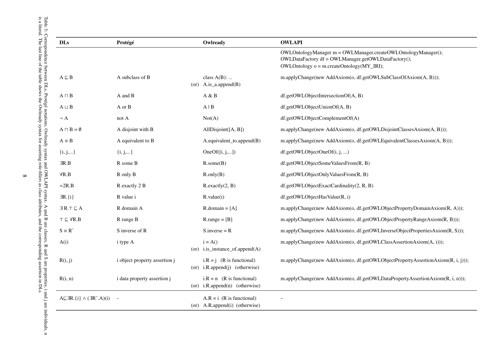

# 帮助文档

gimbiseo 人机对话系统

## 基本用法：

个体名词必须加上引号（英文）
[v动词], [a形容词]
[不], 目前必须始终强制使用[]

一般只需使用一次（在第一次出现时使用），如果保证能够识别词性，可以不加。

例子:

```
   "月球"[v围绕][a蓝色的][v围绕]"太阳"的天体  # 后面加注释
   "月球"[不][v围绕]恒星
   月球[不]围绕太阳 （第二次出现）
   月球[只]围绕太阳 （第二次出现）
```

## 文法

### 词法

个体：专有名词，如地球、月球

类：名词、形容词，如天体、脸色的

关系：动词，如围绕、喜欢

量词：只

否定：不

### 句法

#### 陈述句句法

```
   句子 -> 名词+动词+复合名词    # 地球围绕太阳，地球是蓝色的行星，月球围绕蓝色的围绕太阳的天体
   复合名词 -> 形容词 + 形容词 + ... + 名词  # 蓝色的行星，围绕太阳的行星，红色的围绕太阳的天体
   形容词 -> ..的 | 动宾短语+的  # 蓝色的，围绕太阳的
   动宾短语 -> [不/只] 动词 + 名词
   名词 -> 个体 | 类   # 太阳，行星
```

下定义(陈述句子类):

- 个体 "是" 类，类 "是一种" 类  # 地球是天体，行星是一种天体
- 类 "定义为" ...  # 行星定义为[v围绕]恒星的天体

#### 疑问句句法

一般疑问句：陈述句+？


特殊疑问句：陈述句中的主语或宾语替换成疑问词

例子：什么围绕太阳，哪个天体围绕太阳，地球是什么样的行星


### 常见错误

- 我爱我的祖国

   1. “我的”不能作为形容词，“我的”是物主所有格
   2. 不推荐使用具有相对性含义的词语，祖国是一个相对性词语，应该被理解成一个关系，而不是一个类。
      这句话只能是“`"小王"[v生于]"中国"`”

- 蓝色的星球上居住着人类

  不支持复合名词的主语，应该是“`人类[v居住于][a蓝色的]星球`”

*注* 疑问句的问号是中文的。

### 语法错误与异常

1. 如果语句中有未出现的名词，系统会提示输入
2. 重复陈述句，系统会警告重复输入
3. 语句编译成功，系统会提示重新输入

## 命令

命令必须以`%`开头，接着写命令和命令参数（与shell命令类似）
事先要在commands.py文件中注册

命令本质上是一个函数，参数必须是字符串或者memory中可读取的变量，如知识库中的类和个体，或者Python全局变量，如果在memory中找不到，将作为普通字符串。

例子

```
%print 地球  # 打印地球个体的信息
%print 地球 是一个星球 # 打印地球个体的信息，再打印“是一个星球”
%help 帮助文档
```


## 描述逻辑DLs

系统完全依赖于描述逻辑/OwlReady

例子

`人类[v居住于][a蓝色的]星球`

等价于Dls中，人类$\subseteq$ $\exists$居住于.蓝色的 $\cap$ 星球，即每个人都居住在某个（某些）蓝色的星球上。

| DLs               | 中文句法   | 例子           |
| ----------------- | ---------- | -------------- |
| $A\sqsubseteq B$  | A 是一种 B |                |
| $i : B$           | i 是 A     |                |
| $i:\exists r B$   | i r B      | 地球围绕恒星   |
| $i:\forall r B$   | i 只 r B   | 地球只围绕恒星 |
| $R(i,j)$          | i R j      | 地球围绕太阳   |
| $A:\exists r B$   | A r B      | 男人喜欢女人   |
| $A:\forall r B$   | A 只 r B   | 女人只喜欢玫瑰 |
| $A:\exists r {i}$ | A r i      | 植物依赖太阳   |
| $A\sqcap B$       | A B        | 蓝色的星球     |


